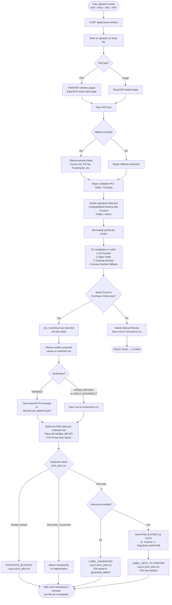
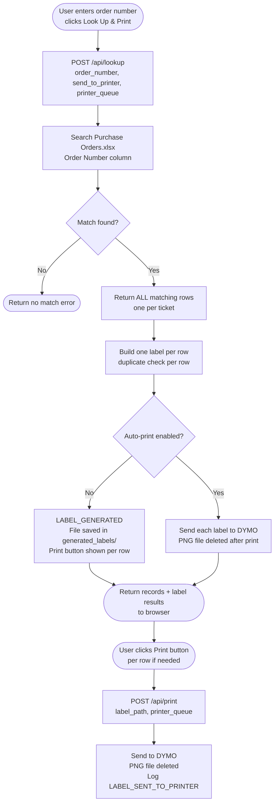
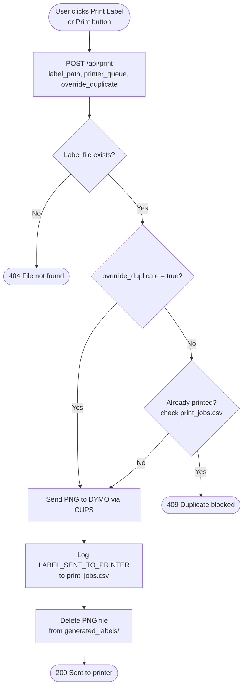
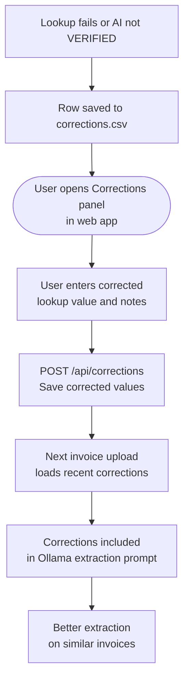

# Invoice OCR Agent — Workflow Diagrams

## Invoice Upload Flow

---

## Manual Order Lookup Flow

---

## Manual Print Flow

---

## Correction Learning Loop

---

## Key Files

| File | Role |
|---|---|
| `web_app.py` | HTTP server, API routes, SSE streaming, concurrent processing |
| `invoice_ocr.py` | OCR, field extraction, vendor detection, Ollama prompts, lookup orchestration |
| `excel_lookup.py` | Searches `Purchase Orders.xlsx`, returns all matching rows |
| `dymo_printing.py` | Builds PNG labels, duplicate tracking, CUPS print, file cleanup after print |
| `approved_excel_files/Purchase Orders.xlsx` | Source of truth for order lookups |
| `print_jobs.csv` | Append-only log of every label event (generated, sent, blocked) |
| `corrections.csv` | Rows needing human review; completed corrections feed into AI prompts |
| `learned_po_patterns.jsonl` | Verified PO→Order matches used to improve future AI extractions |
| `generated_labels/` | Temporary PNG label files (deleted after successful print) |
| `web_static/` | Frontend HTML, CSS, JS |
