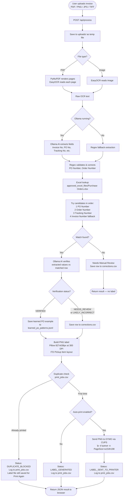
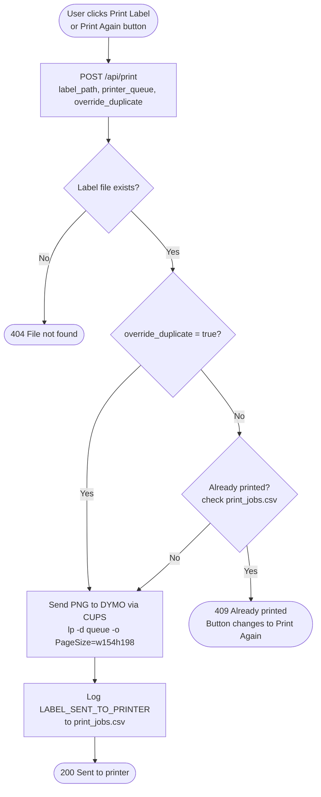

# Invoice OCR Agent — Workflow Diagram

## Main Processing Flow

---

## Manual Print Flow

---

## Key Files

| File | Role |
|---|---|
| `web_app.py` | HTTP server, routes, concurrent file processing |
| `invoice_ocr.py` | OCR reading, field extraction, Ollama prompts, Excel lookup orchestration |
| `excel_lookup.py` | Searches `Purchase Orders.xlsx` Current Year sheet |
| `dymo_printing.py` | Builds PNG label, duplicate tracking, CUPS print command |
| `approved_excel_files/Purchase Orders.xlsx` | Source of truth for order lookups |
| `print_jobs.csv` | Append-only log of every label event (generated, sent, blocked) |
| `corrections.csv` | Rows needing human review; corrected rows feed back into AI prompts |
| `learned_po_patterns.jsonl` | Verified PO→Order matches used to improve future AI extractions |
| `generated_labels/` | Saved PNG label files |
| `web_static/` | Frontend HTML, CSS, JS |
